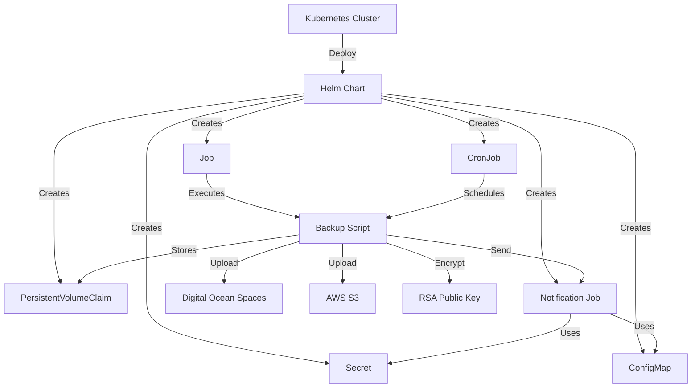

# mysql-k8s-backup

[](README_pt-BR.md)

This MySQL backup automation solution using Helm offers an automated and flexible way to manage MySQL database backups in a Kubernetes environment. Designed with efficiency in mind, it delivers high performance while maintaining a lightweight footprint. With support for different types of backups, flexible scheduling, email notifications, multiple backup destinations, data encryption, and retention management, the solution ensures the security, availability, and optimized resource utilization of database data

## About

- [mysql-k8s-backup](#mysql-k8s-backup)
  - [About](#about)
    - [Solution Architecture](#solution-architecture)
    - [Features](#features)
    - [Configuration Details](#configuration-details)
    - [Use Cases](#use-cases)
    - [How to Deploy the Solution](#how-to-deploy-the-solution)
      - [Prerequisites](#prerequisites)
      - [Deployment Steps](#deployment-steps)
    - [Deployment Verification](#deployment-verification)
    - [Monitoring Backup Execution](#monitoring-backup-execution)
    - [Deleting the Solution](#deleting-the-solution)
    - [Dependency Configuration](#dependency-configuration)
      - [Configuring Buckets on AWS and Digital Ocean](#configuring-buckets-on-aws-and-digital-ocean)
      - [Generating Encryption Keys](#generating-encryption-keys)
    - [Other Tips and References](#other-tips-and-references)

### Solution Architecture

The MySQL backup solution consists of the following components:



### Features

The solution offers the following features:

- **Backup Types**: Support for full schema, incremental schema, full server, and incremental server backups.
- **Scheduling**: Allows configuring multiple backup schedules with different frequencies and execution times.
- **Email Notifications**: Sends email notifications about backup completion and errors, with support for multiple recipients.
- **Backup Destinations**: Support for storing backups in Digital Ocean Spaces and AWS S3.
- **Encryption**: Encrypts backups using RSA public keys.
- **Retention**: Manages backup retention, automatically deleting old backups after a specified period.

### Configuration Details

The MySQL backup solution configuration is managed through the `values.yaml` file. Here are the main configuration sections:

- **MySQL Connection Details**: Configure the MySQL host, port, username, and password.
  
  ```yaml
  mysql:
    host: localhost
    port: 3306
    username: root
    password: password
  ```

- **Backup Types**: Enable or disable different types of backups.
  
  ```yaml
  backupTypes:
    schemaTotal: true
    schemaIncremental: true
    serverTotal: true
    serverIncremental: true
  ```

- **Scheduling**: Configure the scheduling parameters for each type of backup.

  ```yaml
  scheduling:
    schemaTotal:
      frequency: daily
      time: "02:00"
      maxExecutionTime: 60
    schemaIncremental:
      frequency: daily
      time: "04:00"
      maxExecutionTime: 30
    serverTotal:
      frequency: weekly
      dayOfWeek: "Sunday"
      time: "03:00"
      maxExecutionTime: 120
    serverIncremental:
      frequency: daily
      time: "06:00"
      maxExecutionTime: 45
  ```

- **Email Notifications**: Configure the email notification parameters.

  ```yaml
  notifications:
    email:
      enabled: true
      smtp:
        host: smtp.example.com
        port: 587
        username: user@example.com
        password: password
      recipients: recipient1@example.com,recipient2@example.com
  ```

- **Backup Destinations**: Configure the settings for Digital Ocean Spaces and AWS S3.

  ```yaml
  backupDestinations:
    digitalOceanSpaces:
      enabled: true
      accessKey: DO_ACCESS_KEY
      secretKey: DO_SECRET_KEY
      region: nyc3
      bucket: my-backups
    awsS3:
      enabled: false
      accessKey: AWS_ACCESS_KEY
      secretKey: AWS_SECRET_KEY
      region: us-west-2
      bucket: my-backups
  ```

- **Encryption**: Configure the RSA public key for encryption.

  ```yaml
  encryption:
    rsaPublicKeyPath: /path/to/public.key
  ```

- **Retention**: Configure the backup retention period.

  ```yaml
  retention:
    days: 30
  ```

### Use Cases

The MySQL backup solution can be used in various scenarios to ensure reliable and automated backups of MySQL databases. Here are some use cases:

- **Daily Incremental Backups**: Configure daily incremental backups to capture changes made to the database throughout the day.
- **Weekly Full Backups**: Schedule weekly full backups to create a complete snapshot of the database, including data and structure.
- **Email Notifications**: Configure email notifications to receive alerts about backup completion and errors, ensuring timely awareness of backup status.
- **Backups to Multiple Destinations**: Store backups in multiple destinations, such as Digital Ocean Spaces and AWS S3, for redundancy and disaster recovery.
- **Encrypted Backups**: Encrypt backups using RSA public keys to ensure data security and compliance with regulatory requirements.
- **Backup Retention**: Manage backup retention by automatically deleting old backups after a specified period, optimizing storage usage.

### How to Deploy the Solution

#### Prerequisites

- Configured Kubernetes cluster.
- Installed Helm.

#### Deployment Steps

1. Clone the repository:

   ```sh
   git clone https://github.com/devopsvanilla/mysql-k8s-backup.git
   cd mysql-k8s-backup
   ```

2. Configure the `values.yaml` file as needed.

3. Deploy the solution using Helm:

   ```sh
   helm install mysql-backup ./helm/mysql-backup
   ```

### Deployment Verification

To verify if the deployment was successful, run the following command:

```sh
kubectl get pods
```

Check if the pods related to the MySQL backup are running.

### Monitoring Backup Execution

To monitor the execution of backups, you can check the logs of the pods:

```sh
kubectl logs <pod-name>
```

### Deleting the Solution

To delete the solution, run the following command:

```sh
helm uninstall mysql-backup
```

### Dependency Configuration

#### Configuring Buckets on AWS and Digital Ocean

- **AWS S3**: Create a bucket on AWS S3 and configure the access credentials in the `values.yaml` file.
- **Digital Ocean Spaces**: Create a bucket on Digital Ocean Spaces and configure the access credentials in the `values.yaml` file.

#### Generating Encryption Keys

To generate RSA keys for encryption, run the following command:

```sh
openssl genrsa -out private.key 2048
openssl rsa -in private.key -pubout -out public.key
```

Configure the path to the public key in the `values.yaml` file.

### Other Tips and References

- Ensure that the Kubernetes cluster has sufficient resources to run the backup jobs.
- Regularly check the logs of the pods to ensure that backups are being executed as expected.
- Refer to the official Helm and Kubernetes documentation for more information on managing and monitoring resources in the cluster.

___

Made with 💙 by [DevOps Vanilla.guru](https://DevOpsVanilla.guru)
