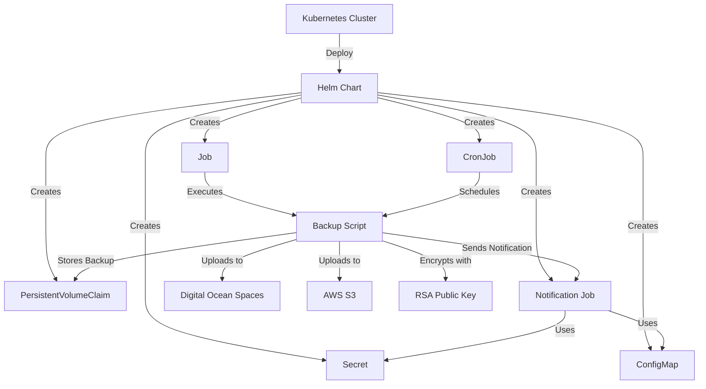

# mysql-k8s-backup [](README.md)

[](README.md)

Automação em MySQL para backups usando K8S

## Objetivos da Solução

A solução de backup de MySQL utilizando Helm tem como objetivo automatizar o processo de backup de bancos de dados MySQL em um ambiente Kubernetes. A solução oferece suporte a diferentes tipos de backup, agendamento flexível, notificações por e-mail, múltiplos destinos de backup, criptografia de dados e gerenciamento de retenção de backups.

## Documentação

- [mysql-k8s-backup ](#mysql-k8s-backup-)
  - [Objetivos da Solução](#objetivos-da-solução)
  - [Documentação](#documentação)
    - [Arquitetura da solução](#arquitetura-da-solução)
    - [Funcionalidades](#funcionalidades)
    - [Detalhes de Configuração](#detalhes-de-configuração)
    - [Casos de Uso](#casos-de-uso)
    - [Como Implantar a Solução](#como-implantar-a-solução)
      - [Pré-requisitos](#pré-requisitos)
      - [Passos para Implantação](#passos-para-implantação)
    - [Verificação da Implantação](#verificação-da-implantação)
    - [Monitoramento da Execução dos Backups](#monitoramento-da-execução-dos-backups)
    - [Exclusão da Solução](#exclusão-da-solução)
    - [Configuração de Dependências](#configuração-de-dependências)
      - [Configuração de Buckets na AWS e Digital Ocean](#configuração-de-buckets-na-aws-e-digital-ocean)
      - [Geração de Chaves de Criptografia](#geração-de-chaves-de-criptografia)
    - [Outras Dicas e Referências](#outras-dicas-e-referências)
  - [Conclusão](#conclusão)

### Arquitetura da solução

A solução de backup de MySQL é composta pelos seguintes componentes:



### Funcionalidades

A solução oferece as seguintes funcionalidades:

- **Tipos de Backup**: Suporte a backups de esquema total, esquema incremental, servidor total e servidor incremental.
- **Agendamento**: Permite configurar múltiplos agendamentos de backup com diferentes frequências e horários de execução.
- **Notificações por E-mail**: Envia notificações por e-mail sobre a conclusão e erros dos backups, com suporte a múltiplos destinatários.
- **Destinos de Backup**: Suporte a armazenamento de backups no Digital Ocean Spaces e AWS S3.
- **Criptografia**: Criptografa os backups utilizando chaves públicas RSA.
- **Retenção**: Gerencia a retenção de backups, excluindo automaticamente backups antigos após um período especificado.

### Detalhes de Configuração

A configuração da solução de backup de MySQL é gerenciada através do arquivo `values.yaml`. Aqui estão as principais seções de configuração:

- **Detalhes de Conexão MySQL**: Configure o host, porta, nome de usuário e senha do MySQL.
  
  ```yaml
  mysql:
    host: localhost
    port: 3306
    username: root
    password: password
  ```

- **Tipos de Backup**: Habilite ou desabilite diferentes tipos de backups.
  
  ```yaml
  backupTypes:
    schemaTotal: true
    schemaIncremental: true
    serverTotal: true
    serverIncremental: true
  ```

- **Agendamento**: Configure os parâmetros de agendamento para cada tipo de backup.

  ```yaml
  scheduling:
    schemaTotal:
      frequency: daily
      time: "02:00"
      maxExecutionTime: 60
    schemaIncremental:
      frequency: daily
      time: "04:00"
      maxExecutionTime: 30
    serverTotal:
      frequency: weekly
      dayOfWeek: "Sunday"
      time: "03:00"
      maxExecutionTime: 120
    serverIncremental:
      frequency: daily
      time: "06:00"
      maxExecutionTime: 45
  ```

- **Notificações por E-mail**: Configure os parâmetros de notificação por e-mail.

  ```yaml
  notifications:
    email:
      enabled: true
      smtp:
        host: smtp.example.com
        port: 587
        username: user@example.com
        password: password
      recipients: recipient1@example.com,recipient2@example.com
  ```

- **Destinos de Backup**: Configure as configurações para Digital Ocean Spaces e AWS S3.

  ```yaml
  backupDestinations:
    digitalOceanSpaces:
      enabled: true
      accessKey: DO_ACCESS_KEY
      secretKey: DO_SECRET_KEY
      region: nyc3
      bucket: my-backups
    awsS3:
      enabled: false
      accessKey: AWS_ACCESS_KEY
      secretKey: AWS_SECRET_KEY
      region: us-west-2
      bucket: my-backups
  ```

- **Criptografia**: Configure a chave pública RSA para criptografia.

  ```yaml
  encryption:
    rsaPublicKeyPath: /path/to/public.key
  ```

- **Retenção**: Configure o período de retenção dos backups.

  ```yaml
  retention:
    days: 30
  ```

### Casos de Uso

A solução de backup de MySQL pode ser utilizada em diversos cenários para garantir backups confiáveis e automatizados de bancos de dados MySQL. Aqui estão alguns casos de uso:

- **Backups Incrementais Diários**: Configure backups incrementais diários para capturar as alterações feitas no banco de dados ao longo do dia.
- **Backups Completos Semanais**: Agende backups completos semanais para criar um snapshot completo do banco de dados, incluindo dados e estrutura.
- **Notificações por E-mail**: Configure notificações por e-mail para receber alertas sobre a conclusão e erros dos backups, garantindo a conscientização oportuna sobre o status dos backups.
- **Backups em Múltiplos Destinos**: Armazene backups em múltiplos destinos, como Digital Ocean Spaces e AWS S3, para redundância e recuperação de desastres.
- **Backups Criptografados**: Criptografe os backups utilizando chaves públicas RSA para garantir a segurança dos dados e conformidade com requisitos regulatórios.
- **Retenção de Backups**: Gerencie a retenção de backups excluindo automaticamente backups antigos após um período especificado, otimizando o uso de armazenamento.

### Como Implantar a Solução

#### Pré-requisitos

- Kubernetes cluster configurado.
- Helm instalado.

#### Passos para Implantação

1. Clone o repositório:

   ```sh
   git clone https://github.com/devopsvanilla/mysql-k8s-backup.git
   cd mysql-k8s-backup
   ```

2. Configure o arquivo `values.yaml` conforme necessário.

3. Implante a solução utilizando Helm:

   ```sh
   helm install mysql-backup ./helm/mysql-backup
   ```

### Verificação da Implantação

Para verificar se a implantação ocorreu com sucesso, execute o seguinte comando:

```sh
kubectl get pods
```

Verifique se os pods relacionados ao backup do MySQL estão em execução.

### Monitoramento da Execução dos Backups

Para monitorar a execução dos backups, você pode verificar os logs dos pods:

```sh
kubectl logs <nome-do-pod>
```

### Exclusão da Solução

Para excluir a solução, execute o seguinte comando:

```sh
helm uninstall mysql-backup
```

### Configuração de Dependências

#### Configuração de Buckets na AWS e Digital Ocean

- **AWS S3**: Crie um bucket no AWS S3 e configure as credenciais de acesso no arquivo `values.yaml`.
- **Digital Ocean Spaces**: Crie um bucket no Digital Ocean Spaces e configure as credenciais de acesso no arquivo `values.yaml`.

#### Geração de Chaves de Criptografia

Para gerar chaves RSA para criptografia, execute o seguinte comando:

```sh
openssl genrsa -out private.key 2048
openssl rsa -in private.key -pubout -out public.key
```

Configure o caminho para a chave pública no arquivo `values.yaml`.

### Outras Dicas e Referências

- Certifique-se de que o cluster Kubernetes tenha recursos suficientes para executar os jobs de backup.
- Verifique regularmente os logs dos pods para garantir que os backups estão sendo executados conforme esperado.
- Consulte a documentação oficial do Helm e Kubernetes para obter mais informações sobre como gerenciar e monitorar recursos no cluster.

## Conclusão

A solução de backup de MySQL utilizando Helm oferece uma maneira automatizada e flexível de gerenciar backups de bancos de dados MySQL em um ambiente Kubernetes. Com suporte a diferentes tipos de backup, agendamento flexível, notificações por e-mail, múltiplos destinos de backup, criptografia de dados e gerenciamento de retenção, a solução garante a segurança e disponibilidade dos dados do banco de dados.

___

Feito com 💙 por [DevOps Vanilla.guru](https://DevOpsVanilla.guru)
