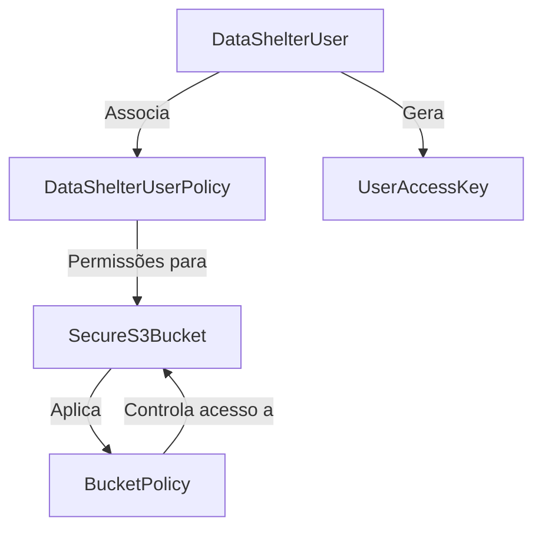

# AWS S3 Secure Bucket Setup

Este documento descreve o propósito do arquivo `create-awss3-resources.yaml`, os recursos que ele cria e como implantá-lo na AWS usando a console web.

## Propósito

O arquivo `create-awss3-resources.yaml` é um modelo AWS CloudFormation que cria um bucket S3 seguro com as melhores práticas de segurança e recursos adicionais, como:

- Controle de acesso rigoroso.
- Regras de ciclo de vida para transição de armazenamento e expiração de backups.
- Políticas para uploads criptografados e transporte seguro.
- Usuário IAM com permissões restritas para upload de arquivos.

## Recursos Criados

O modelo cria os seguintes recursos:

1. **SecureS3Bucket**: Um bucket S3 com:
   - Versionamento habilitado.
   - Bloqueio de acesso público.
   - Regras de ciclo de vida configuráveis para transição de armazenamento e expiração de backups.

2. **BucketPolicy**: Uma política de bucket que:
   - Exige uploads criptografados.
   - Restringe o acesso a conexões seguras (HTTPS).

3. **DataShelterUser**: Um usuário IAM com:
   - Permissões limitadas para upload e marcação de objetos.
   - Restrições para evitar exclusões e downloads de arquivos.

4. **DataShelterUserPolicy**: Uma política gerenciada vinculada ao usuário IAM para controlar permissões.

5. **UserAccessKey**: Uma chave de acesso para o usuário IAM.

## Gráfico de Recursos

O diagrama abaixo ilustra os componentes e suas relações:

## Permissões do Usuário IAM

O usuário IAM criado pelo modelo CloudFormation terá as seguintes permissões no bucket S3:

1. **Permissões de Leitura no Bucket**:
   - Listar objetos no bucket (`s3:ListBucket`).
   - Obter a localização do bucket (`s3:GetBucketLocation`).
   - Listar versões de objetos no bucket (`s3:ListBucketVersions`).
   - Obter a configuração de ciclo de vida do bucket (`s3:GetLifecycleConfiguration`).

2. **Permissões de Operações em Objetos**:
   - Fazer upload de objetos (`s3:PutObject`).
   - Adicionar ou atualizar tags em objetos (`s3:PutObjectTagging`).
   - Obter tags de objetos (`s3:GetObjectTagging`).
   - Obter atributos de objetos (`s3:GetObjectAttributes`).
   - Consultar retenção de objetos (`s3:GetObjectRetention`).
   - Consultar versões de objetos (`s3:GetObjectVersion`).
   - Alterar a classe de armazenamento de objetos (`s3:PutStorageClass`).
   - Consultar a classe de armazenamento de objetos (`s3:GetStorageClass`).
   - Consultar metadados de objetos (`s3:HeadObject`).
   - Copiar objetos (`s3:CopyObject`).

3. **Restrições de Segurança**:
   - **Proibição de Exclusão de Objetos**: O usuário não pode excluir objetos do bucket (`s3:DeleteObject`).
   - **Proibição de Download de Objetos**: O usuário não pode baixar objetos do bucket (`s3:GetObject`).
   - **Proibição de Download de ACL de Objetos**: O usuário não pode acessar as ACLs de objetos (`s3:GetObjectAcl`).

Essas permissões garantem que o usuário possa realizar uploads e gerenciar metadados de objetos, mas não pode excluir ou baixar arquivos, mantendo a segurança e integridade dos dados.

## Como Implantar

Siga os passos abaixo para implantar o modelo na AWS usando a console web:

1. Acesse a [AWS Management Console](https://aws.amazon.com/console/).
2. Navegue até o serviço **CloudFormation**.
3. Clique em **Create stack** e selecione **With new resources (standard)**.
4. Em **Specify template**, escolha a opção **Upload a template file**.
5. Faça upload do arquivo `create-awss3-resources.yaml`.
6. Clique em **Next** e preencha os parâmetros obrigatórios:
   - `BucketName`: Nome do bucket S3.
   - `IamUser`: Nome do usuário IAM.
   - Outros parâmetros, como `Environment`, `DataClassification`, etc.
7. Clique em **Next** e configure as opções adicionais, se necessário.
8. Clique em **Next** novamente e revise os detalhes.
9. Clique em **Create stack** para iniciar a implantação.
10. Aguarde até que o status da pilha mude para **CREATE_COMPLETE**.

Após a implantação, você pode acessar os recursos criados na console AWS.

## Saídas

Após a implantação, as seguintes informações estarão disponíveis nas saídas da pilha:

- **BucketName**: Nome do bucket S3.
- **BucketARN**: ARN do bucket S3.
- **UserName**: Nome do usuário IAM.
- **AccessKey**: ID da chave de acesso do usuário IAM.
- **SecretKey**: Chave secreta de acesso do usuário IAM.

Certifique-se de armazenar as chaves de acesso em um local seguro.
